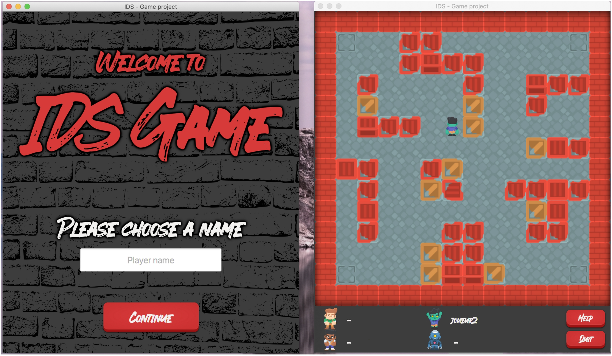

 <h1 align=center> IDS Final Project</h1>




## Description
a simple distributed (multi-server) game where 4 players are moving on a 2D map managed by 4 servers called nodes. Each node is managing a specific zone of the map and can communicate only with players on this zone.

## Requirements 
-  **Java 8 (from oracle)**
-  **JavaFx 2 or higher**
-  **Maven 3 or higher**


## How to run   
### Step 1 : RabbitMQ server
First thing to do is to run a RabbitMQ server locally or on the cloud (see https://www.cloudamqp.com)     
An instance of RabbitMQ server is already running on cloudamqp, if you want set up your own instance, replace URI variable in Network/Queues.java   
   
If you want to run rabbitMQ server locally, replace **factory.setUri(Queues.URI)** by **factory.setHost(Queues.HOST)** in Client.java and Node.java, then run the command below 
```sh
$ rabbitmq-server
```  

### Step 2 : Compilation and packaging
Compile and generate executable jars using the command below, jars will be generated in /target.
```sh
$ mvn package
```   

### Step 3 : Server side
The command below allow you to deploy the server nodes simultaneously   
```sh
$ java -jar target/SERVER.jar
```   

You can choose to run server nodes separatly using this command (make sure to choose a valid node id from 1 to 4)      
Nodes can also be started on different machines
```sh
$ java -jar target/NODE.jar 1
```   

### Step 4 : Client GUI  
Before starting the client, make sure that all nodes are started successfuly.   
Please make sure to use a valid client id (from 1 to 4). It should'nt be used by another player, this eventuality is not handled by this version.
```sh
$ java -jar target/GUI.jar 1
```  


